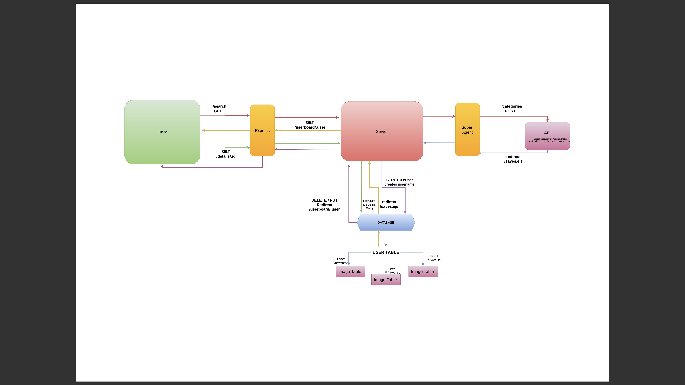

What is the vision of this product? To enable a user to research, create and control their ideas for the future. A user can explore the muriad of options we have available, select what interests them most and then save these options to a personalized board that shows them what they chose. 

What pain point does this project solve? The ability to have a visual representation of the user's goals, with the functionality to give deadlines for accountability. This will create a catered experience for the user, and showcase what they really want out of life. 

Why should we care about your product? Everyone has plans for the future. Often they don't materialize for the lack of planning. This will enable you to see what you want, and hopefully motivate you to get there. 

Scope (In/Out)
IN - What will your product do

This site will allow users to browse a collection of interests and hobbies.

When browsing the hobbies, users can select the ones that interest them the most and save them.

The site will display a separate page for the individual users, showcasing the selections they have made. 

Users can delete selections they have made if their needs change. 

Users will have the ability to add metadata, adding context to images and setting deadlines for themselves. 

OUT - What will your product not do.

Our site will not have any secure login in place.

Minimum Viable Product vs
What will your MVP functionality be?

MVP for us will be a site that displays the options we have linked to and allows the user to save their selections on a separate page. 

What are your stretch goals?

Stretch
What stretch goals are you going to aim for?

We would like to add music to our selection page that randomly plays as you cycle through.

Functional Requirements
List the functionality of your product. This will consist of tasks such as the following:

A user will be able to save their selections to their username page.
A user can search all of the products in the inventory.
A user will be able to revisit the site and be able to retrieve their selections. 

Data Flow

Non-Functional Requirements (301 & 401 only)
Non-functional requirements are requirements that are not directly related to the functionality of the application but still important to the app.

Usability - A user will be able to easily navigate across the different section. They will select the images that best relate to their request and be able to recall them by selecting their username. 

Reliability - We will have a site that will allow the user to make several selections, without constraint, and be able to add or delete their selections without overlap. 
